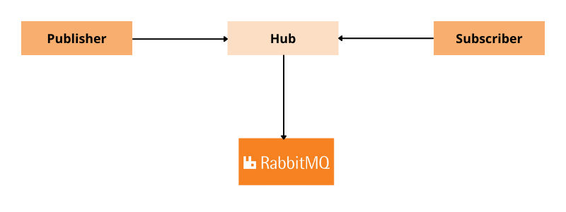

# A Websub Hub Based on RabbitMQ

# Overview

The purpose of this example is to demonstrate the usage of ballerina RabbbitMQ package in a production ready application. 

This is a websub hub implementation based on message brokers. In this case hub is backed by RabbitMQ message broker. Message brokers are a natural fit for the implementation of websub hubs as they serve a similar purpose.

# Implementation and Usage



## Installing and Starting RabbitMQ

Follow the guide [Downloading and Installing RabbitMQ](https://www.rabbitmq.com/download.html), to install and start the RabbitMQ server.

## Starting the Hub
Once those servers are up and running the hub can be started using the following commands. Go into `hub` directory and run following command to build the project.
```shell
bal build 
```

Then to run the project execute the below command.
```shell
bal run target/bin/rabbitmqHub.jar
```

### Starting Multiple Hub Instances

* Copy the `rabbitmqHub.jar` to another location.

* Copy the `Config.toml` which you could find in the project root directory.

* Change the `SERVER_ID` and `HUB_PORT`.

* Go into that location and run the following command.
```shell
bal run rabbitmqHub.jar
```

## Registering Topics
Once all prerequisites are completed, the first interaction to the hub could be made by registering a topic. We have included a sample to understand the usage of `websubhub:PublisherClient` in the `publisher` directory inside the project. Execute the following command to build the `topic_registration_client.bal`.

```shell
bal build topic_registration_client.bal
```

Then execute the below command to run the program.

```shell
bal run topic_registration_client.jar
```

## Subscribing to the Hub
Now we have registered a `topic` in the hub. Next we could subscribe to the previously registered `topic` using `websub:SubscriberService`. Build `subscriber_service.bal` inside `subscriber` directory inside the project using the following command.

```shell
bal build subscriber_service.bal
```

Then execute the below command to run the program.

```shell
bal run subscriber_service.jar
```

## Publishing to the Hub
Content publishing could be considered as the final stage of interaction between a publisher, hub and subscriber. `websubhub:PublisherClient` has support to publish content to the hub. Find the `content_publish_client.bal` located in `publisher` directory and execute the following command to build the program.

```shell
bal build content_publish_client.bal
```

Then execute the below command to run the program.

```shell
bal run content_publish_client.jar
```
